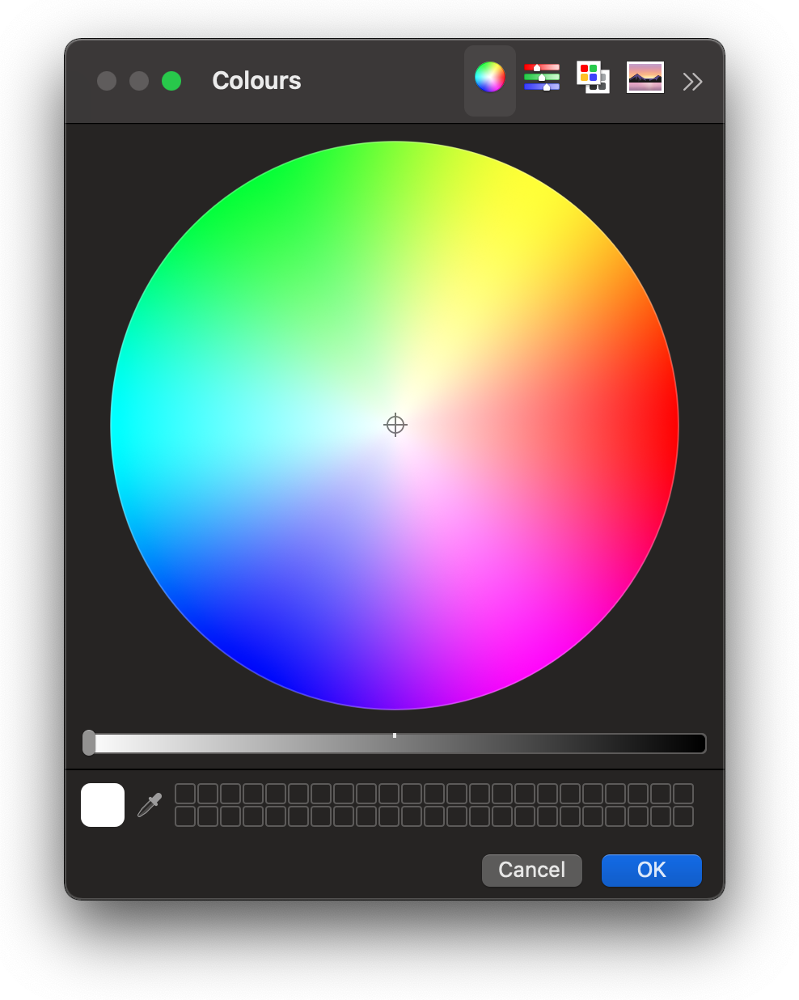

# 🌈 MacOS Colorpicker App Shortcut

A little applescript app to directly access the official Apple colorpicker tool.




## Why?

There is no current way to open the built-in Apple macos colorpicker without using another program to access it. 
This little helper app allows you to open the color-picker without needing to do that. You can drag this into your Applications folder or dock and run whenever you like.


## Credit

The colourpicker app is a compiled version from tinogomes and this GIST at https://gist.github.com/tinogomes/2476447

## Install

Open terminal and run:
```
cd $HOME/Downloads && git clone https://github.com/IORoot/macos__colorpicker--app.git
```
This will download this repo into your home /Downloads folder.

(optional) Drag the Apps into your Application folder. Or just run from wherever you like.

## Changelog

0.0.1 - Inital bundle of tools.